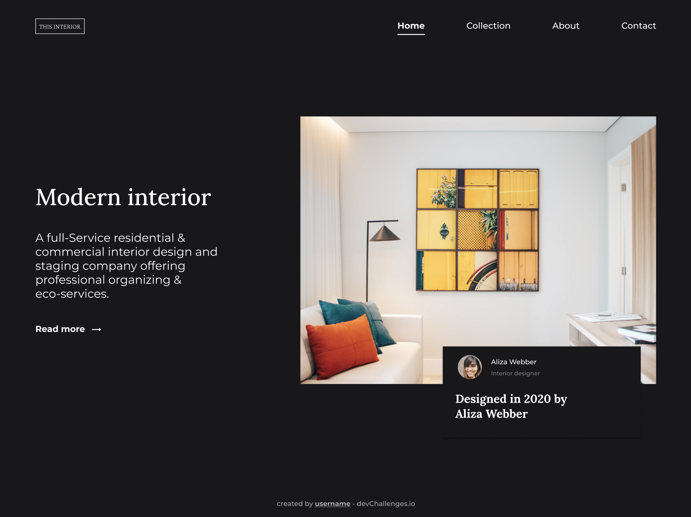

# Interior Consultant Challenge

Solution for a challenge from <a href="http://devchallenges.io" target="_blank">Devchallenges.io</a>.

  <h6>
    <a href="https://neonita.github.io/devchallenges/Responsive-Web-Developer/interior-consultant-master/index.html" target="_blank">
      Demo
    </a>
     | 
    <a href="https://github.com/neonita/devchallenges/tree/main/Responsive-Web-Developer/interior-consultant-master" target="_blank">
      Solution
    </a>
     | 
    <a href="https://devchallenges.io/challenges/Jymh2b2FyebRTUljkNcb" target="_blank">
      Challenge
    </a>
  </h6>

<!-- TABLE OF CONTENTS -->

### Table of Contents

- [Overview](#overview)
  - [Built With](#built-with)
  - [Features](#features)
- [Contact](#contact)
- [Acknowledgements](#acknowledgements)

<!-- OVERVIEW -->

### Overview

###### Result

###### Design

#### Built With

- HTML5 Semantic Elements
- CSS Flexbox & CSS Grid
- Vanilla JavaScript
- BEM Methology

#### Features

This application/site was created as a submission to a [DevChallenges](https://devchallenges.io/challenges) challenge. The [challenge](https://devchallenges.io/challenges/Jymh2b2FyebRTUljkNcb) was to build an application to complete the given user stories.

#### Acknowledgements

<!-- This section should list any articles or add-ons/plugins that helps you to complete the project. This is optional but it will help you in the future. For exmpale -->

- [Steps to replicate a design with only HTML and CSS](https://devchallenges-blogs.web.app/how-to-replicate-design/)
- [BEM naming convention](http://getbem.com/naming/)
- [Hamburger menu reference](https://www.youtube.com/watch?v=flItyHiDm7E)

#### Contact

- GitHub [@neonita](https://github.com/neonita)
